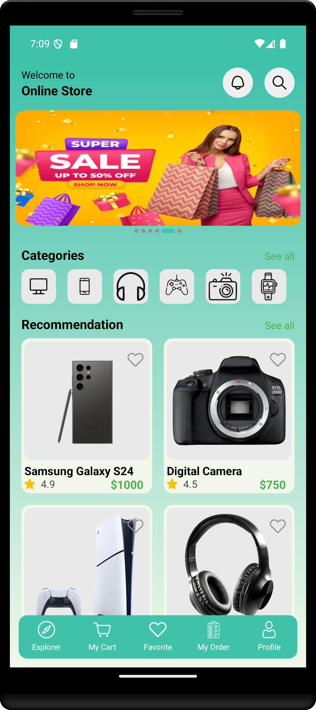

# Online Store App

Welcome to the Online Store App! This mobile app is designed for seamless online shopping, built using Native Android for a smooth and responsive user experience. This Android application allows users to explore and shop a wide range of cutting-edge digital products with a seamless and secure shopping experience. Developed using Native Android and Firebase (Realtime Data and Cloud Storage), this app features an intuitive user interface and robust backend support.

## Features

- **Browse Products**: Explore a diverse selection of digital products.
- **Product Categories**: View products organized into various categories.
- **Auto-Sliding Banner**: Rotating banners showcasing featured products.
- **Secure Shopping**: Register and enjoy a secure shopping experience.
- **Easy Navigation**: User-friendly interface for seamless navigation.

## Technologies Used

- **Android SDK**: For building the native Android application.
- **Firebase**: For real-time database, authentication, and storage.
- **ViewPager2**: For displaying sliding banners.
- **RecyclerView**: For displaying product categories and items.
- **Glide**: For image loading and caching.

## Screenshots
*Below are the screenshots showcasing the app's interface and functionality.*

    
    
    
    

